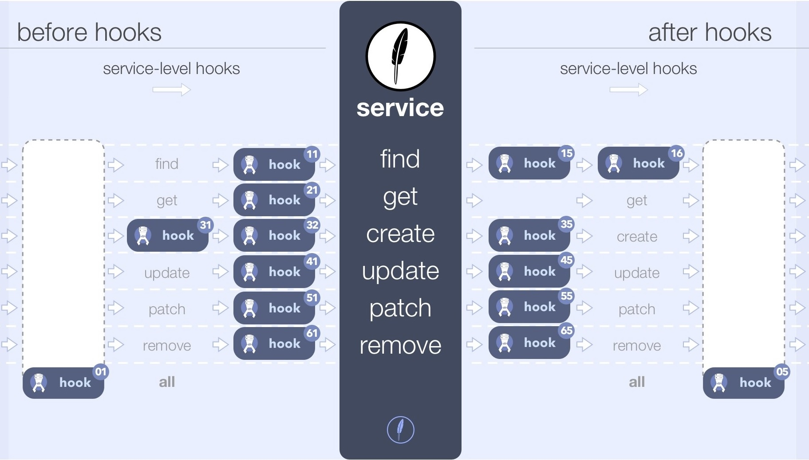

# 훅의 모든 것

## 메소드 훅

각 서비스 메소드에는 고유한 훅이 있을 수 있습니다.
`find`보다는 `create`와 다른 것을 할 필요가 있을 것입니다.


Feathers 코드입니다.

```javascript
const messagesHooks = {
  before: {
    find: hook11(),
    get: hook21(),
    create: [ hook31(), hook32() ],
    update: hook41(),
    patch: hook51(),
    remove: hook61(),
  },
  after: {
    find: [ hook15(), hook16() ],
    create: hook35(),
    update: hook45(),
    patch: hook55(),
    remove: hook65(),
  }
};
const messages = app.service('messages');
messages.hooks(messagesHooks);
```

## 서비스 훅

인증과 같은 일부 훅은 모든 메소드 이전에 실행하여야 합니다.
모든 메소드에 반복하지않고 한번만 지정할 수 있습니다.



 *추가적인* Feathers 코드입니다.

```javascript
const messagesHooks = {
  before: {
    all: hook01(),
  },
  after: {
    all: hook05(),
  }
};
```

## 앱 훅

모든 서비스에 대해 몇가지 훅을 실행할 수 있습니다. [Feathers profiler](https://github.com/feathersjs/feathers-profiler)입니다. 예를 들어 각 서비스 호출 이전과 이후에 훅을 추가할 수 있습니다.


앱 수준 훅의 코드는 다음과 같습니다.

```javascript
app.hooks({
  before: {
    create: hook30a
  },
  after: {
    create: hook39a
  },
});
```

## 에러와 에러 훅

JavaScript, Feathers 데이터베이스 어댑터 또는 자신의 코드로 때문에 훅 내부에 에러가 발생할 수 있습니다.
예를 들어 훅은 다음과 같이 형식이 지정된 메시지를 받을 수 있습니다.

```javascript
// On server
const errors = require('feathers-errors');
throw new errors.BadRequest('Invalid request', {errors: {email: 'Invalid Email'} }); // inside hook

// On client
messages.create(...)
  .then(data => ...)
  .catch(err => {
    console.log(err.messages); // Invalid request
    console.log(err.errors.email); // Invalid Email
  });
```

서비스에서 발생하는 에러를 선택적으로 처리할 수 있습니다.


 *추가적인* Feathers 코드입니다.
 
```javascript
app.hooks({
  error: {
    all: hook00e,
    create: hook30e
  }
});
```

### 잘못되거나 불분명하거나 누락된 부분이 있습니까?
[댓글을 남겨주세요.](https://github.com/feathersjs/feathers-docs/issues/new?title=Comment:Step-Basic-About-Hooks-2&body=Comment:Step-Basic-About-Hooks-2)

