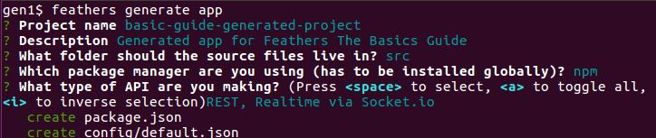
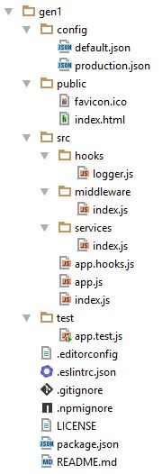

# 제너레이터로 앱 만들기

이제부터 Feathers 제너레이터를 이용해 새 프로젝트를 시작합니다.

프로젝트는 사용자가 있을 것이고 사용자는 한개 또는 여러팀에 속합니다.
우리는 팀과 팀에 소속된 사람을 출력할 것 입니다.

## 앱 만들기

첫째로 할 일은 기본 앱을 만드는 것 입니다. 그러기 위해 새 폴더를 만든 후 이동합니다.

```
mkdir feathers-app
cd feathers-app
```

실행하세요

```
feathers generate app
```



제너레이터는 당신이 선택한 대로 [modules](https://github.com/feathersjs/feathers-docs/blob/master/examples/step/02/gen1/)을 만듭니다.

모듈들은 적절히 서로 연결되는 Feathers 팀에서 권장하는 구조로 되어 있습니다.

대부분 [보일러플레이트](https://en.wikipedia.org/wiki/Boilerplate_code)이며 다음과 같습니다.



## config/

앱의 설정 파일을 포함합니다.
[production.json](https://github.com/feathersjs/feathers-docs/blob/master/examples/step/02/gen1/config/production.json)는
[default.json](https://github.com/feathersjs/feathers-docs/blob/master/examples/step/02/gen1/config/default.json)을 오버라이드 합니다.

배포 모드로 설정하려면 아래 명령어로 실행합니다.
`NODE_ENV=production node path/to/your/server.js`.

## node_modules/

제너레이터는 [npm](https://docs.npmjs.com/) 또는 [yarn](https://yarnpkg.com/en/) 중 하나를 사용해 프로젝트 의존성들을 설치합니다. 사전에 설치되어있어야 합니다.
의존성은 `package.json`에 있습니다.

## public/

제공할 리소스를 포함합니다.
간단한 favion과
[HTML file](https://github.com/feathersjs/feathers-docs/blob/master/examples/step/02/gen1/public/index.html)
이 포함될 수 있습니다..

## src/

Feathers server를 포함합니다..

- **hooks/** 은 사용자 정의 훅을 가집니다.
일반적으로 여러 사용할 수 있을 것 입니다.
간단하지만 유용한
[logger](https://github.com/feathersjs/feathers-docs/blob/master/examples/step/02/gen1/src/hooks/logger.js)가 예제로 제공됩니다.

- **middleware/** Express 미들웨어를 포함합니다.

- **services/** 는 서비스를 포함합니다.

- [index.js](https://github.com/feathersjs/feathers-docs/blob/master/examples/step/02/gen1/src/index.js) 는 node가 앱을 실행하는데 사용합니다.

- [app.js](https://github.com/feathersjs/feathers-docs/blob/master/examples/step/02/gen1/src/app.js)
Feathers와 Express 설정을 가지고 있습니다.

- [app.hooks.js](https://github.com/feathersjs/feathers-docs/blob/master/examples/step/02/gen1/src/app.hooks.js)는 **all** 서비스에서 실행할 훅을 가지고 있습니다.
**이 부분은 이전에 다루지 않았습니다.**
[이러한](https://github.com/feathersjs/feathers-docs/blob/master/examples/step/02/gen1/src/app.js#L43) 훅이 있습니다.


## test/

앱을 위한 테스트를 포함합니다.
[app.test.js](https://github.com/feathersjs/feathers-docs/blob/master/examples/step/02/gen1/test/app.test.js)
인덱스 페이지가 표시되는지 테스트하고, HTML 페이지 및 JSON에 관한 404 오류를 표시합니다.

## [.editorconfig](https://github.com/feathersjs/feathers-docs/blob/master/examples/step/02/gen1/.editorconfig)
는 [EditorConfig project](http://editorconfig.org/)와 호환됩니다.
그리고 다른 편집기 및 IDE간 일관된 코딩 스타일을 정의하고 유지될 수 있도록 도와줍니다.

## [.eslintrc.json](https://github.com/feathersjs/feathers-docs/blob/master/examples/step/02/gen1/.eslintrc.json)
기본적인 코드 린팅을 위한 [ESLint](http://eslint.org/docs/user-guide/getting-started) 설정입니다.


## [.gitignore](https://github.com/feathersjs/feathers-docs/blob/master/examples/step/02/gen1/.gitignore)
[git](https://git-scm.com/),
[GitHub](https://github.com/) 또는 유사 프로젝트에서
[의도적으로 추적하지 않는 파일](https://git-scm.com/docs/gitignore)을 정의합니다.

## [.npmignore](https://github.com/feathersjs/feathers-docs/blob/master/examples/step/02/gen1/.npmignore)
[운영에 배포되지 않을 파일들](https://docs.npmjs.com/misc/developers#keeping-files-out-of-your-package)을 정의합니다.

## [LICENSE](https://github.com/feathersjs/feathers-docs/blob/master/examples/step/02/gen1/LICENSE)
[라이센스](https://docs.npmjs.com/files/package.json#license)를 포함합니다.
사람들이 어떤 권한을 갖는지 어떤 제한사항이 있는지 알 수 있도록 합니다.

기본 값은 Feathers 라이센스입니다.

## [package.json](https://github.com/feathersjs/feathers-docs/blob/master/examples/step/02/gen1/package.json)
은 [npm](https://docs.npmjs.com/),[yarn](https://yarnpkg.com/en/) 또는 다른 패키지 매니저가 어떤 의존성을 설치해야하는지에 관한
[정보](https://docs.npmjs.com/files/package.json)를 포함합니다.

## 이제 무엇을 해야하나요?

만들어진 코드는 익숙할 것입니다.
이전에 다루었던 내용 이상의 것들은 별로 없습니다.

Feathers 생성기를 사용하면서 얻을 수 있는 장점은

- 앱의 구조를 만들어 줍니다.
생성된 모듈은 Feathers 팀이 권장하는 구조를 따릅니다.

- 꼭 할 필요 없는 보일러플레이트 작업을 대신 해줍니다.

- 데이터베이스 관련 처리를 합니다.
제너레이터는 다양한 데이터베이스를 처리하기 위한 직접 깊게 살펴보지 않아도 될 코드를 만듭니다.

다음은 [생성된 앱에 인증 추가하기](./gen-authentication.md)입니다.

### 잘못되거나 불분명하거나 누락된 부분이 있습니까?
[댓글을 남겨주세요.](https://github.com/feathersjs/feathers-docs/issues/new?title=Comment:Step-Generators-App&body=Comment:Step-Generators-App)
