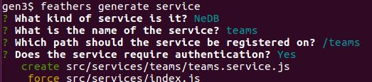
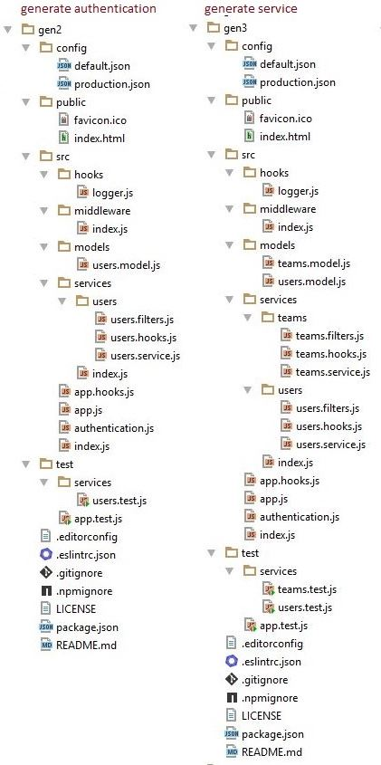

# Teams 서비스 추가

We now generate the teams service using

```
feathers generate service
```



The generator will add some new modules and modify some existing ones.
You can see all the changes here:
[Unified](http://htmlpreview.github.io/?https://github.com/feathersjs/feathers-docs/blob/master/examples/step/_diff/02-gen3-line.html)
|
[Split](http://htmlpreview.github.io/?https://github.com/feathersjs/feathers-docs/blob/master/examples/step/_diff/02-gen3-side.html)


## 새 모듈

The directory has changed:



## Teams 서비스

We saw the `users` service being added previously.
The `teams` service has been added in exactly the same way.
There is nothing new.
The boilerplate differs only in the names of the services.

> **Generators.**
The Feathers generators are great for roughing out a project,
creating something in its approximate, but not finished, form.
The generators will write most of the boilerplate you need,
while you concentrate on the unique needs of the project.

### 잘못되거나 불분명하거나 누락된 부분이 있습니까?
[댓글을 남겨주세요.](https://github.com/feathersjs/feathers-docs/issues/new?title=Comment:Step-Generators-Service&body=Comment:Step-Generators-Service)
